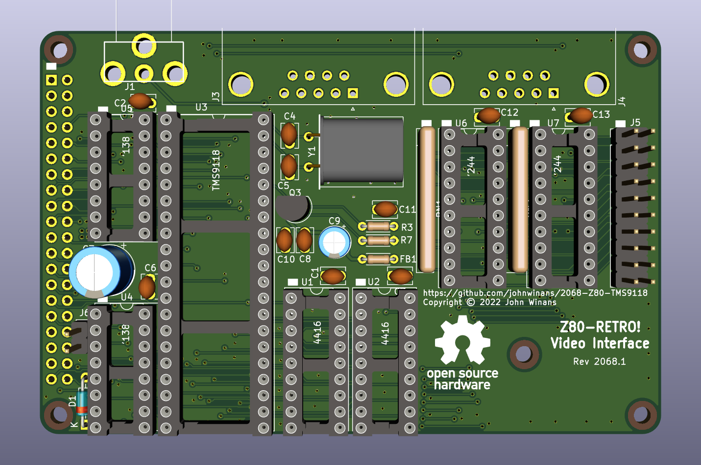

A composite video board for a [2063-Z80](https://github.com/johnwinans/2063-Z80) board.

* A youtube playlist discussing this project and how to build your own can be found in 
[John's Basement](https://www.youtube.com/watch?v=oekucjDcNbA&list=PL3by7evD3F51Cf9QnsAEdgSQ4cz7HQZX5)
* A PDF version of the schematic can be found [here](2068-Z80-TMS9118.pdf).

