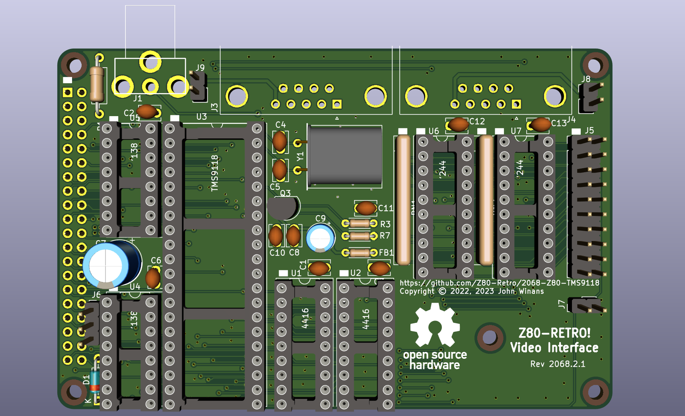

# VDP Retro board Rev 1

NOTE: The Rev 1 schematic is based on the bodge-hacked version of Rev 0 as seen on John's 
Basement.  The Rev 1 PCB is being tested now.  This message will be changed after it has 
been confirmed that the Rev 1 PCB is functional. (ETA December 7, 2022)

A composite video board for a [2063-Z80](https://github.com/johnwinans/2063-Z80) board.

* A youtube playlist discussing this project and how to build your own can be found in 
[John's Basement](https://www.youtube.com/watch?v=oekucjDcNbA&list=PL3by7evD3F51Cf9QnsAEdgSQ4cz7HQZX5)
* A PDF version of the schematic can be found [here](2068-Z80-TMS9118.pdf).

# Where to get parts

I ordered my VDP on Ebay from [hifiic](2068-Z80-TMS9118.sch) on [this auction](https://www.ebay.com/itm/322191622624?hash=item4b041e01e0:g:ldwAAOxyQBJREMaa)

I ordered my DRAMs on Ebay from [ruixin2020](https://www.ebay.com/str/ruixin2020) on [this auction](https://www.ebay.com/str/ruixin2020)

I ordered my long pin header on Amazon [here](https://www.amazon.com/gp/product/B084Q4W1PW/ref=ppx_yo_dt_b_search_asin_title?ie=UTF8&psc=1)

See the [BOM](2068-Z80-TMS9118.md) for the rest of the parts and Digikey order numbers.
